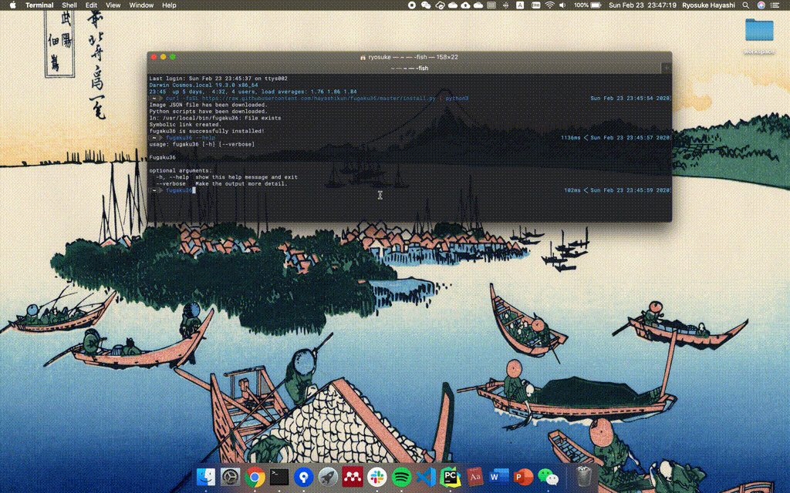

# fugaku36

Update desktop background image every day with randomly selected `Thirty-six Views of Mount Fuji` for macOS.

You can change background image with `fugaku36` command. 

By registering `fugaku36.plist` to launchd, desktop image is updated automatically every day.



# install

```sh
$ curl -fsSL https://raw.githubusercontent.com/hayashikun/fugaku36/master/install.py | python3
```

If you want to update image automatically, you have to register fugaku36.plist to launchd.

```sh
$ sudo cp ~/.cache/fugaku36/fugaku36.plist ~/Library/LaunchAgents/fugaku36.plist
$ launchctl load ~/Library/LaunchAgents/fugaku36.plist
```


# uninstall

```sh
$ rm -rf ~/.cache/fugaku36
```

If you have registered launchd.

```sh
$ sudo rm -rf ~/Library/LaunchAgents/fugaku36.plist
```
